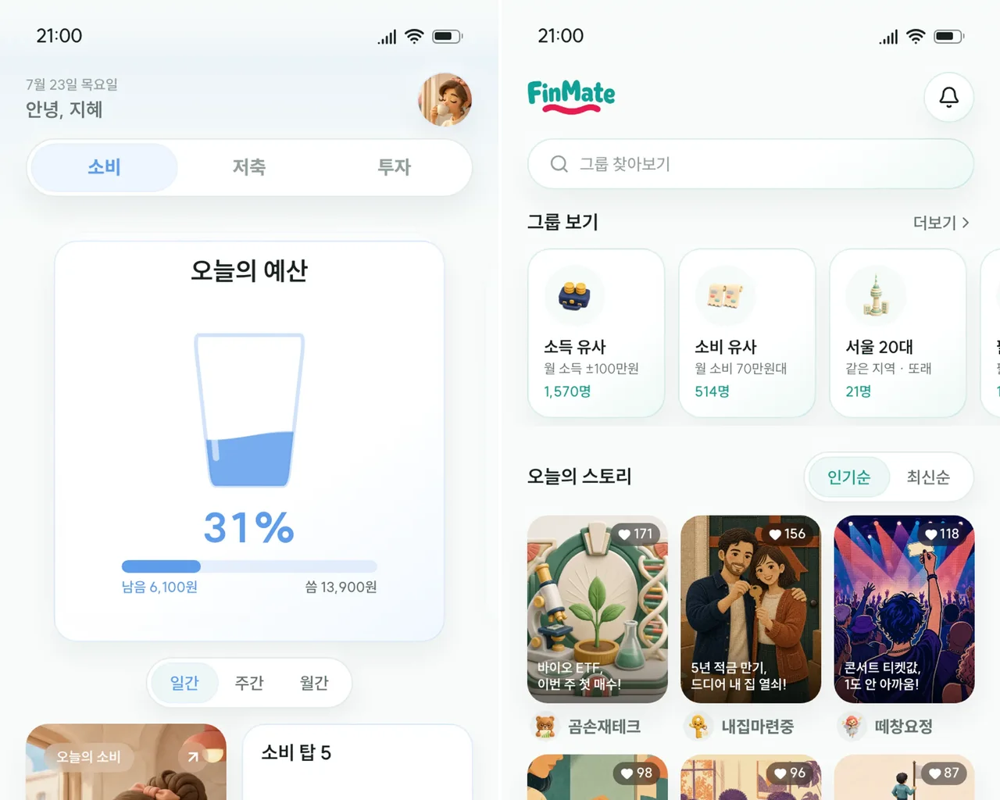

# 성진혁의 백엔드 포트폴리오

소비를 비교하는 FinMate와 좌석을 예약하는 콘서트 예매를 중심으로, 서비스의 문제와 선택 이유, 확인한 결과를 읽을 수 있는 포트폴리오입니다.

[새 포트폴리오](https://sjh9714-backend.vercel.app) · [이력서 PDF](https://sjh9714-backend.vercel.app/resume-sung-jinhyuk.pdf) · [기존 사이트](https://sjh9714.vercel.app)

새 버전은 `codex/portfolio-cases` 브랜치와 별도 Vercel 프로젝트에서 제공합니다. 기존 사이트와 `main`의 배포는 유지합니다.

## 사이트에서 볼 수 있는 것

| 화면 | 내용 |
|---|---|
| 홈 | 대표 두 프로젝트의 목적, 역할, 핵심 판단과 근거 |
| FinMate | 무거래자와 자료 없음을 구분한 평균, 같은 결과를 내는 조회 대안의 비교 |
| 콘서트 예매 | 좌석의 소유 예약을 확인하는 반환, 예약·결제·취소·만료의 상태 관리 |
| 추가 프로젝트 | 채팅의 저장·복구, ETA의 외부 정보 처리, 정산 Gateway |
| 이력서 | 대표 세 프로젝트를 선별한 화면과 2쪽 PDF |

팀 작업과 개인 보강, 실제 구현과 모의 데이터를 구분합니다. 저장소 README에는 서비스 사용법을 두고, 이 사이트에는 기술 선택과 검증 범위를 설명합니다.

## 읽는 흐름

홈에서 사례 제목을 누르면 상세 본문으로 이동합니다. 각 사례는 프로젝트와 역할, 문제의 조건, 관찰한 원인, 대안과 선택, 결과, 남은 한계를 담고 있습니다. 수치 가까이에 실험 조건과 원자료 링크가 있습니다.



제품 화면은 해당 프로젝트의 실행 화면을 사용합니다. 이미지 출처는 [화면 출처 목록](docs/screen-sources.json)에 기록합니다. 사이트 구성과 글의 기준은 [작성 지침](docs/writing.md)에서 확인할 수 있습니다.

## 실행

Node.js 22와 npm을 사용합니다.

```bash
npm ci
npm run dev
```

`http://localhost:3000`에서 열립니다. `npm run build`는 정적 사이트를 `out/`에 생성합니다. 별도 백엔드나 CMS는 없습니다.

## 구성

```text
src/content/     프로젝트·사례·근거·프로필·이력서
src/components/  화면 구성 요소
public/          화면 이미지·구조도·PDF
scripts/         글·링크 검사와 산출물 생성
e2e/            화면 이동·접근성·모바일 검사
docs/facts/     수치의 출처와 사용 범위
```

사실과 수치는 `src/content/evidence.ts`에서 관리하며 홈, 상세, 이력서의 문장은 읽는 목적에 맞게 따로 작성합니다. 전후 변화, 대안 비교, 단일 관측은 구분해 표시합니다.

## 수정 후 확인

```bash
npm run lint
npm run typecheck
npm run lint:writing
npm run build
npm run check:links
npx playwright test
```

CI는 같은 검사와 7개 페이지의 Lighthouse 모바일 검사를 수행합니다. 근거 파일은 GitHub의 커밋 주소로 고정합니다. 링크 검사는 정적 산출물의 내부 경로·앵커와 외부 HTTP 응답을 확인합니다.

이력서의 내용이나 인쇄 레이아웃, 폰트를 바꾸면 PDF를 다시 생성합니다.

```bash
# fontTools와 brotli가 준비된 Python 사용. 필요하면 PDF_PYTHON으로 실행 파일 지정.
node scripts/subset-font.mjs
BASE_URL=http://localhost:3000 node scripts/resume-pdf.mjs
npm run lint:writing
npm run build
```

PDF 해시는 콘텐츠뿐 아니라 인쇄 CSS·폰트·생성 스크립트도 포함합니다. 생성 후에는 실제 두 페이지의 여백, 잘림, 사례 링크를 확인합니다.

## 공개 범위

이 사이트와 FinMate의 기존 시연 화면은 무료 Vercel Hobby 환경에서 제공합니다. Java 서비스, PostgreSQL, 메시지 브로커를 포함한 전체 데모는 각 저장소의 Docker Compose로 실행합니다. 컨테이너 이미지를 게시한 상태와 공개 백엔드 서버가 실행 중인 상태는 구분합니다.
